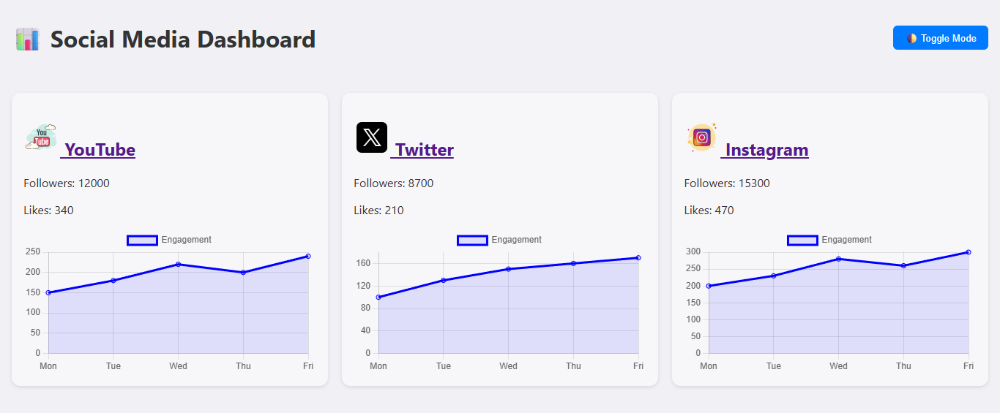

# 📊 Social Media Dashboard

This project is a stylish and responsive Social Media Dashboard that visually displays real-time follower and like statistics for major platforms including **YouTube**, **X (Twitter)**, and **Instagram**.



---

## 🚀 Features

- 🔴 **YouTube (SpaceX)**: Subscriber stats and activity chart  
- 🔵 **X / Twitter (Elon Musk)**: Follower stats and weekly performance  
- 🟣 **Instagram (SpaceX)**: Follower and engagement visualizations  
- 🌗 **Dark/Light Mode Toggle**  
- 📈 **Animated Charts** via Chart.js  
- 🔗 Clickable social profile links with platform icons  

---

## 🛠 Technologies Used

- HTML5 + CSS3
- JavaScript (Vanilla)
- Chart.js for dynamic data visualization
- Flask (`url_for`) for static asset routing

---
## 🧪 How to Run

1. Clone this repository
```
git clone https://github.com/Nomahk25/real-time-social-stats.git
```
3. Install Flask if not already:
   ```bash
   pip install flask

## Run the server

python app.py
Visit http://localhost:5000

## NOTES

1. This dashboard uses Elon Musk’s and SpaceX’s public profiles as real working examples.

2. All icons are local PNG images and not dependent on CDN links.

## AUTHOR

Built with ❤️ by Nomanguni Khumalo

## LICENCE

This project is open-source and free to use
